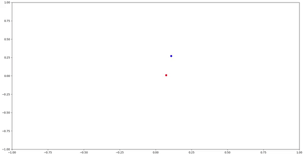

2D Environement

Blue dot (agent) is tracking a moving Red Dot.

The Red dot is always faster than the blue dot, thus the agent "should" learn to plan in advance

When reaching space limit, the dots bounces.

The episode is done when blue dot "catches" red dot (within a small distance)

